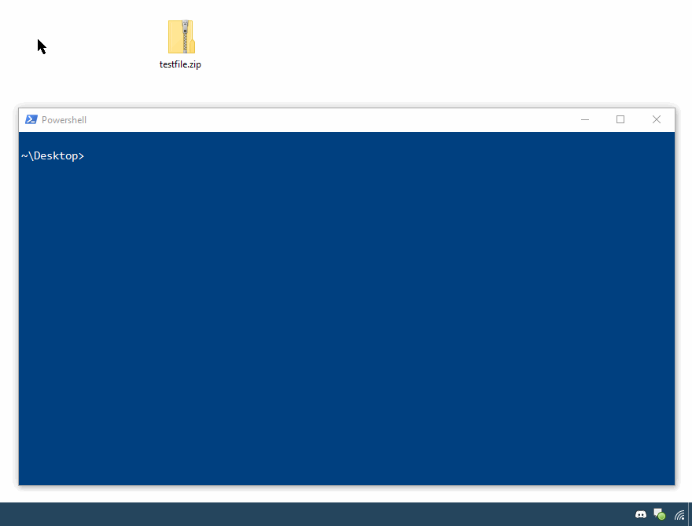
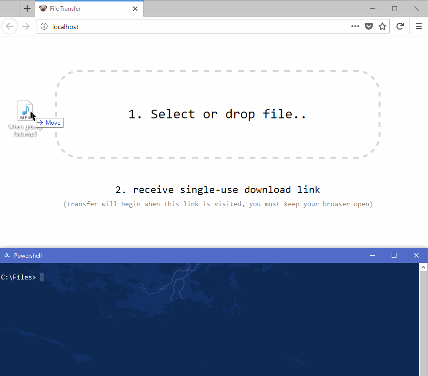

## webrelay.exe
Command line utility for hosting a file or stream over HTTP. It can be installed as a service (`webrelay --install`) to move the HTTP server out-of-process or to another machine. A test instance is running at [fy.lc](http://fy.lc). All of the parameters can be specified in `webrelay.exe.config` as well, the command line arguments take precedent. The service uses the values in the config.
```powershell
Webrelay [[-listenPrefix] <String>] [[-remoteHost] <String>] [[-filename] <String>] [[-contentType] <String>] [-inline] [[-maxConnections] <Int>] inputFile
```

Parameter | Description
----------|------------
listenPrefix `-l` | Hostname and port on which to listen (e.g.: http://*:80/)
remoteHost `-r` | Remote instance to relay through instead of listening on this machine (e.g.: ws://fy.lc)
filename `-f` | Value to be used in content-disposition header, defaults to input filename unless --inline is specified
inline `-i` | Use inline content-disposition (no download prompt)
contentType `-c` | Value to be used in content-type header, defaults to "text/plain" if filename is blank
maxConnections | Max concurrent connections
install | Install service
uninstall | Uninstall service
username | (Default: LocalSystem) Username for service (ignored unless --install is specified)
password | Password for service if necessary (ignored unless --install is specified)
help | Display this help screen.
version | Display version information.

Demo:


================

## WebrelayTray.exe
GUI for quickly copying the download link to your clipboard for any file from the right-click menu in explorer. It shows the status of the download in the tray and raises a balloon notification when the download completes. You can add the following registry key to add the right-click menu to all files (change `C:\\Path\\To\\` to wherever you put webrelaytray, and remove the semicolon in front of `;"Extended"` if you want to only show the item when shift is held):
```ini
Windows Registry Editor Version 5.00

[HKEY_CLASSES_ROOT\*\shell\WebRelay]
@="Copy download link"
"Icon"="C:\\Path\\To\\WebRelayTray.exe"
;"Extended"=""

[HKEY_CLASSES_ROOT\*\shell\WebRelay\command]
@="C:\\Path\\To\\WebRelayTray.exe \"%1\""
```


Demo:


================

## Webclient
The server has a built-in webclient you can enable or disable in the config `<add key="enableWebclient" value="true"/>`.

Demo:


